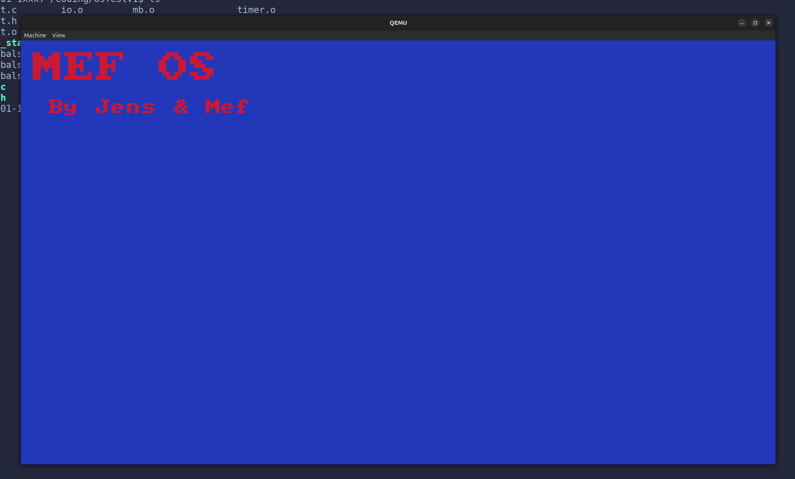
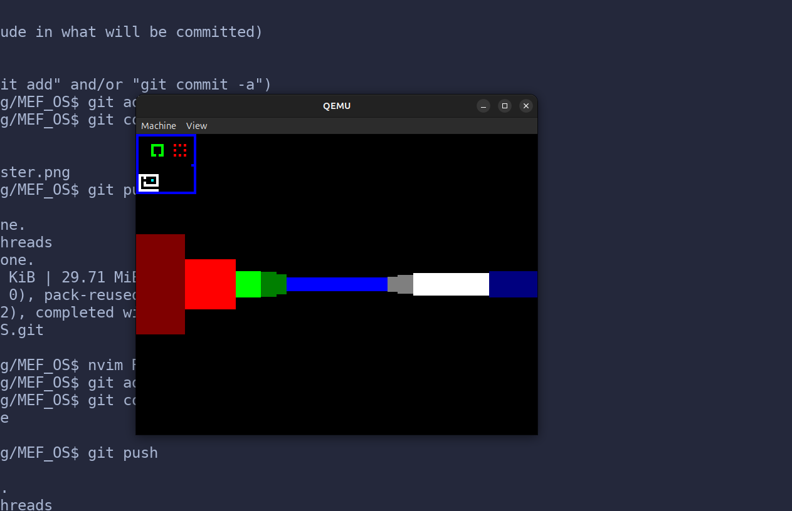

# MEF_OS

A very limited OS designed to (not yet) render a raycaster.





# Compiling
Get the AArch64 bare-metal target (aarch64-none-elf) from [Arm GNU Compiler](https://developer.arm.com/downloads/-/gnu-a)
Put it in a folder called "cross_compiler" and unzip it 
You should be good to go

# Use on real Hardware
If you want to use the OS for a real Raspberry pi 4 you first need to download the RPI OS like normally on a SD-Card.
Then delete all files that start with kernel and copy the compiled kernel8.img and config.txt onto the disk.

# UART and Emulation

For qemu testing get qemu with:
```sudo apt install qemu-system-arm```

Then run:
```./run_qemu.sh```

---
If you have a TTL wire you can use screen to see the output of UART (works only on real hardware)
```sudo screen /dev/ttyUSB0 115200```

# DEBUGGING:
Dependency:
sudo apt install gdb-multiarch

1. run ./run_qemu_debug.sh
2. in a second terminal run ./gdb_start.sh
3. type command (in gdb): layout asm
4. type command (in gdb): target remote localhost:1234

then you can do normal gdb debugging

add breakpoints with: break main or break 0xXXXXXXX (memory address)
you can see values of variables with p (VARIABLE_NAME)
run the code till the next breakpoint with: continue

---
BTW the project requires specific hardware so dont even try to run it xD

# Credits
- uses bitfield font from: [font](https://github.com/dhepper/font8x8.git)

# FEATURES
- GPIO Pins Control 
- UART sending 
- UART receiving
- Mailbox Messages
- Framebuffer
- Timers
- Double Buffering
- Font Rendering


